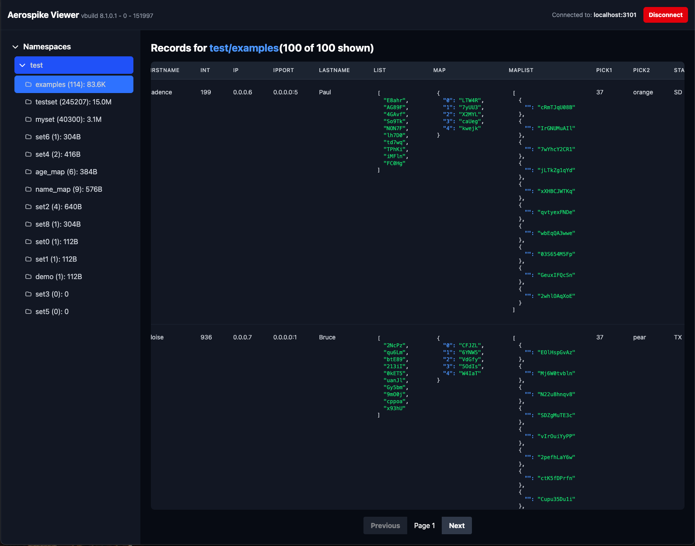

# Aerospike Viewer

A modern, web-based UI for browsing and analyzing your Aerospike database, complete with AI-powered schema analysis via Google Gemini.

This tool provides a clean and efficient interface to connect to your Aerospike cluster, explore namespaces, view sets and their records, and gain insights into your data structures. It is built as a full-stack TypeScript application and is fully containerized with Docker for easy deployment.



---

## ✨ Features

- **Connect to any Aerospike Cluster**: Simple connection form to point the viewer to your cluster's host and port.
- **Cluster Stats Overview**: At-a-glance view of server version, uptime, and total object count right in the header.
- **Namespace & Set Browser**: Hierarchical tree view to navigate through namespaces and the sets within them.
- **Data Usage Insights**: See the number of objects and human-readable data size (`KB`, `MB`, `GB`) for each set.
- **Paginated Record Viewer**: Efficiently browse records in large sets with a paginated interface (100 records per page).
- **Detailed Record Table**:
    - Displays a continuous record number across pages.
    - Shows the record's primary key (PK) in a readable hex format.
    - Automatically generates columns for all bins found in the current page of records.
- **Embedded JSON Viewer**: Complex data types like maps and lists are displayed in a clean, collapsible JSON viewer within the table.
- **AI-Powered Schema Analysis**: Leverage Google Gemini to automatically analyze a sample of records and generate a human-readable summary of the set's schema.
- **Dockerized for Production**: A multi-stage `Dockerfile` is included to build a small, efficient production image for easy deployment.

## 🛠️ Tech Stack

- **Frontend**: React, TypeScript, Tailwind CSS
- **Backend**: Node.js, Express, TypeScript
- **Database Client**: Official Aerospike Node.js Client
- **AI Integration**: Google Gemini API
- **Containerization**: Docker

---

## 🚀 Getting Started

You can run the application locally for development or build and run it as a Docker container.

### Prerequisites

- Node.js (v20.x or later recommended)
- npm
- Docker (for containerized deployment)

### Local Development

1.  **Clone the repository:**
    ```bash
    git clone https://github.com/your-username/aerospike-viewer.git
    cd aerospike-viewer
    ```

2.  **Install dependencies:**
    ```bash
    npm install
    ```

3.  **Set up Environment Variables:**
    Create a `.env` file in the root of the project and add your Google Gemini API key. This is required for the AI schema summary feature.
    ```
    # .env
    API_KEY="YOUR_GEMINI_API_KEY"
    ```

4.  **Run the Backend Server:**
    In a terminal, start the Node.js/Express backend. It will run on `http://localhost:8080`.
    ```bash
    npm run server
    ```

5.  **Run the Frontend Application:**
    In a second terminal, start the React development server.
    ```bash
    npm start
    ```

6.  **Access the Viewer:**
    Open your browser and navigate to `http://localhost:3000`. You can now connect to your Aerospike cluster from the UI.

---

## 🐳 Docker Deployment

The included `Dockerfile` uses a multi-stage build to create a lightweight and optimized production image.

1.  **Build the Docker Image:**
    From the root of the project, run the build command:
    ```bash
    docker build -t aerospike-viewer .
    ```

2.  **Run the Docker Container:**
    Run the container, mapping the internal port `8080` to a port on your host machine (e.g., `8080`). You must also pass your Gemini API key as an environment variable.

    ```bash
    docker run -d -p 8080:8080 -e API_KEY="YOUR_GEMINI_API_KEY" --name aerospike-viewer-container aerospike-viewer
    ```
    - `-d`: Run the container in detached mode.
    - `-p 8080:8080`: Map port 8080 on the host to port 8080 in the container.
    - `-e API_KEY="..."`: Securely provide your Gemini API key.
    - `--name ...`: Give your container a memorable name.

3.  **Access the Viewer:**
    Open your browser and navigate to `http://localhost:8080` (or whichever host port you mapped).

    Since the application is now running in a Docker container, it can be easily deployed to any cloud instance or server in the same VPC as your Aerospike cluster for secure, low-latency access.

---

## 🔐 Security

For a production deployment, it is highly recommended to place this application behind a reverse proxy (like Nginx or Caddy) and add authentication (e.g., Basic Auth, OAuth) to restrict access.

